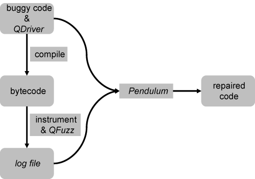

# Pendulum: Timing Side Channel Mitigation via Automated Program Repair

## Introduction

This is the replication artifact for the paper "Timing Side Channel Mitigation via Automated Program Repair".

## Setup

### Requirements

* Java 8
* Gradle 7.4.1

### Setup

Run the following commands to set up the tool:

```
cd tool
./setup.sh
```

There are five tools in `tool/`.  If everything is successful, AFL will display `[+] All done!`, and gradle will display `BUILD SUCCESSFUL` for the other four tools.

To confirm compilation success further, run

```
java -jar tool/pendulum/build/libs/pendulum.jar --help
```

Pendulum should display a help message:

```
Usage: Pendulum [-h] -f=<logFile> -o=<outDir>
Locate and repair timing side channel vulnerabilities, given a QFuzz log file.
  -f, --log-file=<logFile>   Log file of Qriver
  -h, --help                 Display this help message
  -o, --output-dir=<outDir>  Output dir of repaired codes
```

And Pendulum is now good to go.

## Quick Trial

For a quick trial, pick a subject in `evaluation/subjects/` and use our ready-made makefile.

For example, run

```
cd evaluation/subjects/blazer_passwordEq_unsafe
make
```

The makefile is self-documented and will display all its targets:

```
compile                        Compile the original source code to bytecode
compile_fixed                  Compile the fixed source code to bytecode
instr                          Instrument the original bytecode for fuzzing
instr_fixed                    Instrument the fixed bytecode for fuzzing
testfuzz                       Test if compilation and instrumentation of original source code succeeded
repair                         Repair the timing side channel vulnerability in the original source code using Pendulum
server                         Start Kelinci server for the (instrumented) original bytecode
server_fixed                   Start Kelinci server for the (instrumented) fixed bytecode
fuzz                           Start AFL to fuzz the (Kelinci server of) original code
fuzz_fixed                     Start AFL to fuzz the (Kelinci server of) fixed code
count                          Retrieve the largest number of partitions from the log file (for the original code)
count_fixed                    Retrieve the largest number of partitions from the log file (for the fixed code)
compile_evo                    Compile Evosuite tests
run_evo                        Run Evosuite tests on the original code
run_evo_fixed                  Run Evosuite tests on the fixed code
clean                          Clean up
cleanbin                       Clean up all bytecode
cleansrc                       Clean up fixed source code
cleanfuzz                      Clean up fuzzer artifacts (AFL output dir and log file)
```

### Fuzzing & Repair

First, run `make instr`. `compile` is a dependency of `instr` and will be executed automatically. The output should look like
```
File written: bin-instr/Driver_Greedy.class
File written: bin-instr/User.class
(and more)
```

This indicates that the instrumentation is finished.

Then run `make server`. Note that this would block the terminal, so you may want to split the terminal (with tmux for example) beforehand or use a second terminal later. This gives

```
Fuzzer runs handler thread started.
Server listening on port 7007
```

Then run `make fuzz` to start the fuzzer. After one or two minutes (this is what it takes for this simple program), press `Ctrl + C` to kill the server and the fuzzer (they will NOT stop automatically; you have to stop them manually. If you want a particular timeout, say 30 minutes, use `timeout 30m make fuzz`); the order does not matter. Check `server.log`, which should look like

```
====report begins====
#clusters=2
K=100
public=m25(0A,3680A'2/2
secret  cost
5A6Am25(0A,3680A    38
'2/25A6m25(0A,36    38
...
/25A6m25(0A,3680    38
====report ends====
...
```

Finally `make repair`. The repaired code will be output to `src_fixed/`. `User.java` will have been changed, and the other files are copied to this directory verbatim.

To check the effect of the repair, you can use the targets `instr_fixed`, `server_fixed`, and `fuzz_fixed` to run QFuzz on the repaired code.

NOTE: not all subjects have a runnable repaired version. Check the "Regression Tests" column in Table 1 in our paper; only the subjects for which figures are available have a runnable repaired version.

### Retrieving the Number of Partitions

The number of partitions in QFuzz quantifies the vulnerability. In the log file (`server.log` for the original program, and `server.fixed.log` for the repaired program), this is indicated with the lines `#clusters=...`. The largest number in the whole file is taken as the number of partitions.

The two targets `count` and `count_fixed` help retrieve this number.

### Regression Test

For each subject, we generated a regression test suite with EvoSuite. This is in `evosuite-tests`.

The three targets `compile_evo`, `run_evo`, and `run_evo_fixed` help perform regression tests.

## Workflow



To repair a program that may have timing side channel vulnerability, the first step is to fuzz the program with *QFuzz* to expose the vulnerability.  Then *Pendulum* takes the source code and the *fuzzing log* to produce the repaired code. Below are steps for repairing a new vulnerable program.

### Writing a QDriver

A fuzz driver is needed for QFuzz to fuzz a program. Moreover, the driver needs to produce a log file that is to be parsed by Pendulum later. The logging job is handled by the abstract class `pendulum.AbstractQDriver`; the user needs to implement a driver class that inherits from `AbstractQDriver`, which we call *QDriver*. In our experiments, the QDriver's class name is simply `QDriver`; this name will be used later.

The two methods that must be overridden are `parseInput` and `runOne`. See the `AbstractQDriver` source file for more details.

### Compiling the QDriver (and the Source)

Take care to provide **all necessary classpaths** for `javac`. These are:

* the source directory of the Program Under Test (PUT)
* supporting libraries of the PUT
* `tool/pendulum/build/libs/pendulum.jar` (for `AbstractQDriver`)
* (optional) `tool/instrumentor/build/libs/kelinci.jar` (if your QDriver invokes `Kelinci`; see `AbstractQDriver.java`)

Suppose the output directory is `bin/`. The command should look like:

```
javac -cp "src:other_libs.jar:pendulum.jar:kelinci.jar" src/QDriver.java -d bin
```

Just compile the QDriver, and its dependencies (i.e., the PUT) will be compiled recursively.

### Instrumenting the Bytecode

The instrumentation serves to count the number of bytecode instructions executed by the PUT, by which QFuzz discovers timing vulnerabilities. This is performed by the class `edu.cmu.sv.kelinci.instrumentor.Instrumentor` in `tool/instrumentor/build/libs/kelinci.jar`.

Suppose the bytecode of the QDriver and the PUT is in `bin/`. The command for instrumentation should look like:

```
java -cp tool/instrumentor/build/libs/kelinci.jar edu.cmu.sv.kelinci.instrumentor.Instrumentor -i bin -o bin-instr
```

### Running QFuzz

QFuzz builds on AFL, which fuzzes C programs only. Kelinci "fools" AFL into fuzzing Java programs by introducing two intermediaries: an *interface* (`tool/fuzzerside/interface`) written in C, which receives AFL input, and a *Kelinci server* (`edu.cmu.sv.kelinci.Kelinci`) written in Java, which receives forwarded AFL input from the interface and runs the actual Java PUT. They communicate over TCP.

The Kelinci server should be started first. Internally, it runs `pendulum.DriverMain`, a wrapper for the QDriver.  The command should look like:

```
java -cp "bin-instr:other_libs.jar:pendulum.jar" edu.cmu.sv.kelinci.Kelinci -port 7070 -K 100 pendulum.DriverMain QDriver @@ | tee server.log
```

Note that in this command,

* (classpath) the **instrumented** bytecode has to be provided, as well as other supporting libraries. `pendulum.jar` is needed to run QDriver.
* (port) the port can be any free port. Remember to use the **same** port later to start AFL.
* (`-K` parameter) `-K` is a parameter of QFuzz, which usually defaults to 100. Check the QFuzz paper for details.
* (`DriverMain`) as mentioned above, `DriverMain` is a wrapper for the QDriver. It has a `main` method that takes two command line arguments: the class name of the QDriver, and the file name of the fuzzer input. Remember that we use `QDriver` for the QDriver's class name. Remember also that in Kelinci, `@@` is a placeholder for the fuzzer input, as in AFL. Hence we have the `pendulum.DriverMain QDriver @@` part.
* (log redirection) the QDriver prints logs to the standard output by default; we want to redirect it to a file for analysis by Pendulum.

Once the server is up, start AFL to fuzz the interface:

```
tool/afl-2.51b-qfuzz/afl-fuzz -i in_dir -o out_dir -c quantify -K 100 -S afl tool/fuzzerside/interface -p 7070 -K 100 @@
```

In this command,
* `-i in_dir` and `-o out_dir` are for AFL. `in_dir` has to contain at least one file that does not crash the QDriver.
* `-c quantify` and `-S afl` are for QFuzz.
* the two `-K`'s mean the same as in the last command and should take that same value.
* the port (`-p`) should be the same as in the last command.

The fuzzing campaign is now on! The Kelinci server should be outputting lots of logs, which come from the QDriver.

Finally, stop fuzzing in due course. Two or three minutes is usually enough for simple programs. In our experiments, we used a timeout of thirty minutes, which proved an ample time.

### Using Pendulum to Analyze Log and Mitigate Vulnerability

The class `pendulum.Pendulum` takes two command line arguments, as shown in the help message:

```
Usage: Pendulum [-h] -f=<logFile> -o=<outDir>
Locate and repair timing side channel vulnerabilities, given a QFuzz log file.
  -f, --log-file=<logFile>   Log file of Qriver
  -h, --help                 Display this help message
  -o, --output-dir=<outDir>  Output dir of repaired codes
```

More importantly, the correct classpath needs be provided when invoking this class. The classpath should include:

* the source directory of the PUT, as Pendulum searches for source code in the classpath.
* the bytecode of the PUT (that is not yet instrumented by the Kelinci instrumentor). Pendulum would internally instrument it, but in a different way.
* other supporting libraries of the PUT.
* `pendulum.jar`, as the `Pendulum` class is from this jar.
* (optional) `kelinci.jar` (if your QDriver invokes `Kelinci`)

So the command should look like:

```
java -cp "src:bin:other_libs.jar:pendulum.jar:kelinci.jar" pendulum.Pendulum -f server.log -o src_fixed
```

`src_fixed` now has the repaired source code.

### Fuzzing Repaired Code

Note that only vulnerable files (that is, as deemed by Pendulum) are repaired and written to the output directory. To compile the repaired version conveniently, you may want to copy all unchanged files to the output directory:

```
rsync -av --ignore-existing src/* src_fixed
```

Also, the repaired code uses a helper class that needs to be copied to the output directory:

```
mkdir -p src_fixed/pendulum/safe
cp tool/pendulum/src/main/java/pendulum/safe/Safe.java src_fixed/pendulum/safe
```

Now the repaired version can be compiled and fuzzed by QFuzz with the same steps as the above to evaluate the mitigation in timing vulnerability.

### Regression Testing

We use EvoSuite to generate a regression test suite. All Evosuite dependencies are in `tool/validation/lib/`. Supposing the class-under-test is `foo.Bar` in `src/` and depends on `other_libs.jar`, the command for generating the test suite would be

```
java -jar tool/validation/lib/evosuite-1.2.0.jar -Duse_separate_classloader=false -class foo.Bar -projectCP "src:other_libs.jar"
```

It produces `evosuite-tests/` and `evosuite-reports/`; we only use `evosuite-tests/`. To compile the test suite, put the EvoSuite dependencies as well as the PUT on the classpath. The command looks like

```
javac -cp "tool/validation/lib/*:bin:other_libs.jar" $(find evosuite-tests -type f) -d evosuite-tests-bin
```

Finally, to run the test suite, the command looks like

```
java -cp "tool/validation/lib/*:evosuite-tests-bin:bin:other_libs.jar" org.junit.runner.JUnitCore foo.Bar_ESTest
```

To run the test suite for the repaired program, replace `bin/` with `bin_fixed`. That is,

```
java -cp "tool/validation/lib/*:evosuite-tests-bin:bin_fixed:other_libs.jar" org.junit.runner.JUnitCore foo.Bar_ESTest
```

## Replication

For timing vulnerability repair & mitigation (Table 1 but the last column), check [`evaluation/README.md`](evaluation/README.md).

For repair validation (Table 2 and the last column of Table 1), check [`tool/validation/README.md`](tool/validation/README.md).
